# FinRL-X 운영 구조

목표 비중은 전략·위험검사·가상체결·평가가 공유하는 계약이다. FinRL-X/FinRL-Trading의 `BaseStrategy`와 `StrategyResult` API를 사용하고, 실제 시세 수집·가상계좌·프로세스 관리·복구는 `src/stockrl/platform`과 프로젝트의 시세·계좌 모듈이 담당한다. `champion.pt`의 기존 MoE 결합부와 allocation head를 이어받고, 64D latent와 실제 시장·계좌 상태를 TorchRL Allocator에 전달한다.

```mermaid
flowchart LR
  Feed[실시간 시세 / 과거 재생] --> Obs[시점 일치 관측]
  Obs --> Expert[고정 Expert 공유 서비스]
  Expert --> MoE[Champion MoE 결합부 / 64D latent]
  MoE --> Policy[TorchRL Allocator + 실제 시장 feature]
  Policy --> Risk[통화별 위험검사]
  Risk --> Result[FinRL-X StrategyResult]
  Result --> Paper[다음 관측에서 가상체결]
  Paper --> Reward[비용 반영 순자산 변화]
  Reward --> Journal[SQLite 경험 기록]
  Journal --> Learner[TorchRL PPO / 별도 CPU 프로세스]
  Learner --> Revision[작은 정책 버전 / 복원]
  Revision --> Policy
```

Expert 20개의 원본 가중치는 frozen이다. `champion.pt` 안에서 이미 학습된 Adapter·Router·Fusion·Attention·Controller를 정확히 복원한다. 추가 Allocator 보정층의 출력은 0으로 초기화하고, 원래 allocation head를 출발점으로 결합부와 Allocator를 함께 학습한다. 기존 3개 모델 실행·승급 시험·수작업 학습 runner는 운영 경로에서 제외한다. MacroHFT 36+9 입력이나 MarketGPT ITCH 입력이 없는 경우 입력 부족을 명시하며 과거 데이터를 현재 입력으로 바꾸지 않는다.

20개는 원본 자산 수이며 동시 실행 수를 뜻하지 않는다. 선택한 Expert 중 원본 입력과 자원 조건이 맞는 모델을 순회 실행한다. RAM·VRAM 조건이 부족하면 자원 대기로 표시하고 다음 실행 기회에 다시 확인한다.

종목 수는 정책 파라미터 크기와 독립적이다. 통화마다 자산 집합과 현금을 함께 판단하고, 미수신 자산은 비중을 바꾸지 않는다. 학습 경험은 종목 집합과 정책 버전이 맞는 그룹으로 처리한다.

추론은 하나의 Expert 풀을 사용한다. GPU에는 한 Expert만 올리고, 실제 가용 RAM·VRAM과 관측된 peak를 확인한다. 학습은 별도 CPU 프로세스에서 진행하고 추론에는 유효한 작은 정책 버전만 전달한다. 상태·경험·오류·제어는 운영 API가 관리한다. 모든 운영 설정은 `configs/operations.json`에서 읽는다.

FinRL-X upstream `4409abe925c904e570be78ebfb5e77ac3491dff8`, TorchRL `0.14.0`, TensorDict `0.14.2`, 공식 키움 SDK `953e5dbff123f437ab4d11a78a95191a685eb51f`를 사용한다. 키움 OAuth와 WebSocket 연결은 공식 SDK, 국내 체결가와 미국 FE 메시지는 시세 어댑터, 통화별 비용·정수 주식 체결은 가상계좌가 담당한다. 최종 비중은 실제 `BaseStrategy.generate_weights()`와 `StrategyResult` 계약을 통과한다.
