# FinRL-X 운영 구조

목표 비중은 전략·잔고·가격 확인·가상체결·평가가 공유하는 계약이다. FinRL-X/FinRL-Trading의 `BaseStrategy`와 `StrategyResult` API를 사용하고, 실제 시세 수집·가상계좌·프로세스 관리·복구는 `src/stockrl/platform`과 프로젝트의 시세·계좌 모듈이 담당한다. `champion.pt`의 기존 MoE 결합부와 allocation head를 이어받고, 64D latent와 실제 시장·계좌 상태를 TorchRL Allocator에 전달한다.

```mermaid
flowchart LR
  Feed[실시간 시세 / 과거 재생] --> Obs[시점 일치 관측]
  Obs --> Expert[통합 Champion 내부 Frozen Expert / GPU]
  Expert --> MoE[Champion MoE 결합부 / 64D latent]
  MoE --> Policy[TorchRL Allocator + 실제 시장 feature]
  Policy --> Risk[통화별 잔고·가격 확인]
  Risk --> Result[FinRL-X StrategyResult]
  Result --> Paper[다음 관측에서 가상체결]
  Paper --> Reward[비용 반영 순자산 변화]
  Reward --> Journal[SQLite 경험 기록]
  Journal --> Learner[TorchRL PPO / 같은 GPU 프로세스의 학습 스레드]
  Learner --> Revision[작은 정책 버전 / 복원]
  Revision --> Policy
```

12개는 원본 자산 수이며 동시 실행 수를 뜻하지 않는다. 선택한 Expert 중 원본 입력과 자원 조건이 맞는 모델을 순회 실행한다. RAM·VRAM 조건이 부족하면 자원 대기로 표시하고 다음 실행 기회에 다시 확인한다.

종목 수는 정책 파라미터 크기와 독립적이다. 통화마다 자산 집합과 현금을 함께 판단하고, 미수신 자산은 비중을 바꾸지 않는다. 학습 경험은 종목 집합과 정책 버전이 맞는 그룹으로 처리한다.

실행 주체는 통합 MoE 프로세스 하나다. Expert·중앙 판단·PPO는 GPU를 공유하는 독립 작업 스레드로 실행한다. 중앙 판단은 학습 중인 파라미터를 직접 읽지 않고 마지막 발행 정책을 사용한다. 텐서 출력은 같은 프로세스의 GPU 메모리 캐시로 전달하며 SQLite를 추론 전달 통로로 사용하지 않는다. 원본 API의 NumPy/DataFrame/JSON 출력은 필요한 작은 값만 GPU로 전달한다. GPU 상주 모델은 유지하고 초과분만 RAM 또는 부분 레이어 오프로드한다. GGUF는 같은 MoE가 소유하는 전용 llama.cpp 엔진으로 실행한다. 시세와 API는 별도 프로세스다. 시장 프레임과 가격표는 입력 파일이 바뀔 때만 재생성하고 여러 단계가 공유한다.

FinRL-X upstream `4409abe925c904e570be78ebfb5e77ac3491dff8`, TorchRL `0.14.0`, TensorDict `0.14.2`, 공식 키움 SDK `953e5dbff123f437ab4d11a78a95191a685eb51f`를 사용한다. 키움 OAuth와 WebSocket 연결은 공식 SDK, 국내 체결가와 미국 FE 메시지는 시세 어댑터, 통화별 비용·정수 주식 체결은 가상계좌가 담당한다. 최종 비중은 실제 `BaseStrategy.generate_weights()`와 `StrategyResult` 계약을 통과한다.

종목별 최대 비중·총 투자 비중·turnover 제한·MDD 강제 청산은 적용하지 않는다. 목표 비중과 현금 비중은 모델이 선택한다. 손실폭은 관측 값으로 전달하며, 손익과 체결 비용으로 학습한다. 관측이 없는 보유자산과 현금 계좌의 실제 잔고는 체결 가능한 범위를 계산할 때 유지한다.

학습 배치는 같은 종목 집합과 허용된 실제 학습 세대의 경험만 묶는다. 선택 변경을 저장한 체크포인트 번호와 optimizer가 갱신된 세대를 구분한다. 화면의 다음 배치 진행도는 전체 미처리 경험 합계가 아니라 가장 많이 모인 동일 구성의 경험 수를 표시한다.

통합 `champion.pt`에는 선택한 frozen Expert 몸체, 저비트 실행 정의, GGUF 원본 바이트, 중앙 학습 상태가 포함된다. 기존 `registered_vertical_trading_moe_v2` 형식에 `frozen_experts`와 구성 합계를 포함해 체크포인트 호환성을 유지한다. 입력·모델 정의·부품 라이브러리는 추가 전 검사와 교체에 사용한다. 실행 중에는 작은 중앙·optimizer 체크포인트를 원자적으로 발행하고, 정상 정지·구성 변경 때 최신 중앙 상태를 전체 Champion에 합친다. Expert를 제거하면 해당 몸체와 frozen 파라미터가 통합 파일에서 빠진다. 학습한 중앙 연결부·optimizer는 이름별로 승계하며, 선택 변경은 저장·재구성·운영 제어 복원 순서로 처리한다. 중앙 네트워크 용량의 자동 확장은 현재 지원하지 않는다.

슬롯마다 Adapter·Router·context Router·projection을 독립 파라미터로 둔다. 출력 크기에 맞춰 새 연결을 만들고 기존 이름의 학습 가중치·Adam moment는 유지한다. 64D 공통 attention과 최종 의사결정부는 Expert 수와 독립적이다. 기존 슬롯 선택은 학습 체크포인트를 보존하고 통합 몸체를 재구성한 뒤 실행을 복원한다.

경험에는 실제 사용한 Expert 마스크가 관측으로 남는다. 현재 제외된 Expert가 있어도 당시 행동의 likelihood를 당시 마스크로 계산한다. 제외된 슬롯의 전용 파라미터는 optimizer에서 갱신하지 않으며, 재사용할 때 그대로 이어받는다. 새로운 입출력 슬롯 추가·실제 삭제는 자동으로 모든 저장 정책의 구조를 맞추고 호환되지 않는 미처리 경험을 제외한다.

Allocator는 정규분포의 잠재 점수를 표본 추출하고 sparsemax로 자산·현금 비중을 계산한다. 비중 0을 허용하며 종목 수에 고정 상한을 두지 않는다. PPO에는 원래 표본 추출한 잠재 행동과 log probability를 기록하므로, 실제 reward와 다른 임의의 행동을 학습하지 않는다. 기존 MoE·Allocator 가중치와 이름이 같은 parameter의 Adam 상태를 정책 전환 시 이어받는다.

KRW와 USD 계좌의 현금·포지션·손익·모델 계좌 특성·reward·체결 원장은 분리한다. 두 금액의 환전 합계는 제공하지 않는다. 새 체결 원장은 계좌·경험 처리와 같은 transaction에서 기록하며, 통화와 체결 순번을 기준으로 조회한다. bounded 계좌 미리보기에서 기록이 빠져도 체결 원장은 유지한다. 원장이 없는 과거 체결은 누적 카운터와 구분해 누락 건수로 표시한다.
