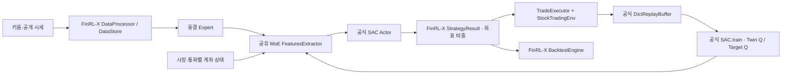

# 운영 구조

## 공식 구현과 연결부

학습 손실, 행동 분포, Twin Q, Target Q 갱신, 자동 엔트로피 조정, Replay 샘플링은 Stable-Baselines3 2.9.0에서 실행한다. FinRL-X 공식 강화학습 예제의 기반 라이브러리와 같다. 자체 SAC 알고리즘이나 Actor·Critic 계층을 재구현하지 않는다.

`policy.py`는 기존 MoE를 BaseFeaturesExtractor로 등록하고 공식 SACPolicy를 운영 관측에 연결한다. 기본 Actor는 종목 비중 점수와 현금 선호 두 값을 출력한다. 종목별 정책 가중치를 공유하므로 종목 개수가 바뀌어도 새로운 Actor를 만들지 않는다. 통화별 실제 계좌 보상을 각 종목 경험에서 공유한다. 전체 종목을 하나의 고정 길이 행동 벡터로 학습하는 구조와는 다르다.

MoE는 512차원, Attention heads 8, KV heads 4, head dimension 64, SwiGLU 1,792차원이다. 공개 Qwen Attention·SwiGLU·RMSNorm을 금융 Expert 의견 결합에 사용한다. 동결 Expert와 상위 학습 네트워크를 구분한다.

`learner.py`는 공식 SAC.train을 호출하고 실제 원장 기록을 공식 Replay에 등록한다. 과거 행동은 목표 비중이 같아지도록 재표현하며, 미지원 관측은 제외한다. Replay는 공식 저장·복원 API로 재시작 후 이어간다. 버퍼는 설정의 최대 개수와 메모리 예산으로 제한한다.

시세는 공식 DataProcessor 가격 정제와 DataStore upsert·조회 API를 사용한다. 분 단위 시각이 일별로 잘리지 않도록 ISO 문자열로 전달한다. CSV는 키움·Expert의 기존 스트리밍 입력 캐시다. 거래소·호가 같은 모델별 입력과 캐시 보존 정책은 도메인 연결부에서 담당한다.

백테스트는 공식 BacktestEngine으로 실행한다. 전략 생성 훅에서 다음 관측 시점의 기록 비중을 지정해 현금을 유지한다. 비용 계산과 성과 지표는 공식 엔진에서 얻는다. 기본 엔진의 100% 투자 정규화가 현금 비중을 바꾸지 않게 한다.

API와 시세는 별도 프로세스다. Expert, 판단, 학습은 하나의 GPU 소유 프로세스에서 별도로 진행한다. 판단 모델은 마지막 발행된 가중치로 추론하며 학습 종료를 기다리지 않는다. Expert는 GPU 우선 상주하고 VRAM 초과분만 오프로드한다.

SAC 가중치·optimizer는 FP32, 운영 추론은 CUDA BF16이다. 통합 champion.pt는 동결 Expert와 중앙 상태를 포함한다. 공식 SAC.save / SAC.load로 중앙 버전·Actor optimizer·Critic optimizer·엔트로피·Target Q를 저장하고 정상 정지 때 전체 모델에 반영한다. 부품 추가·제거는 이름을 기준으로 남은 가중치·Adam 상태를 승계한다.

FinRL-X TradeExecutor에 가상계좌 어댑터를 등록한다. 키움 연결, KRW/USD 분리 계좌, 체결은 공식 StockTradingEnv.step을, 보상 수익 계산은 공식 performance_analyzer.calculate_returns를 사용한다. 로그 수익률 단위·통화별 비용 표시만 연결부에서 맞춘다. FinRL-X의 Alpaca 전용 실행기를 키움 구현으로 표시하지 않는다. 실제 주문은 꺼져 있다.

Windows 프로세스 점검은 APScheduler BackgroundScheduler가 예약한다. FinRL-X에 프로세스 supervisor가 있다는 식으로 표시하지 않는다. 일봉도 공식 DataStore 스키마를 쓰고 Expert 기간 설정은 market_context.json에서 읽는다.
